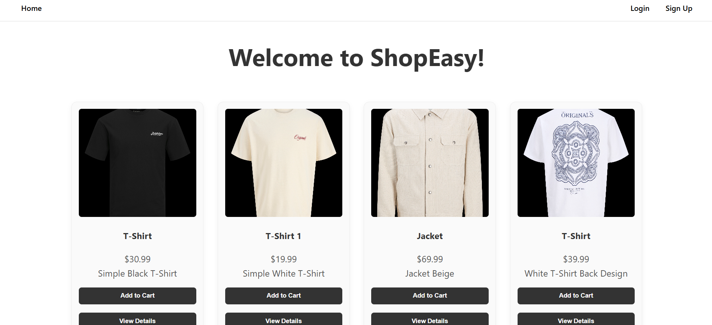
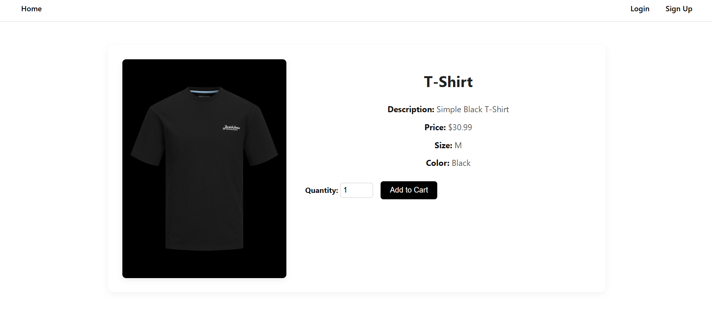
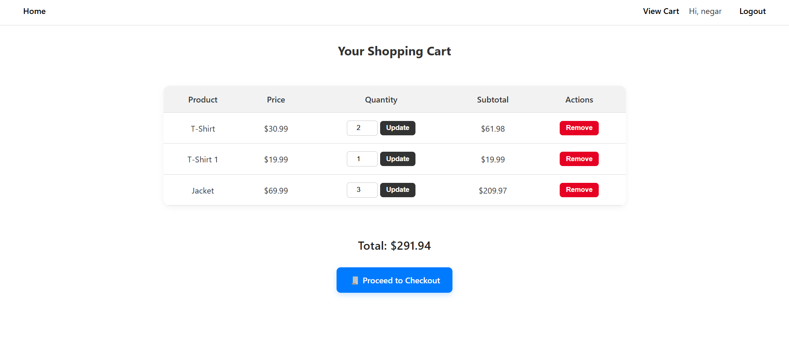
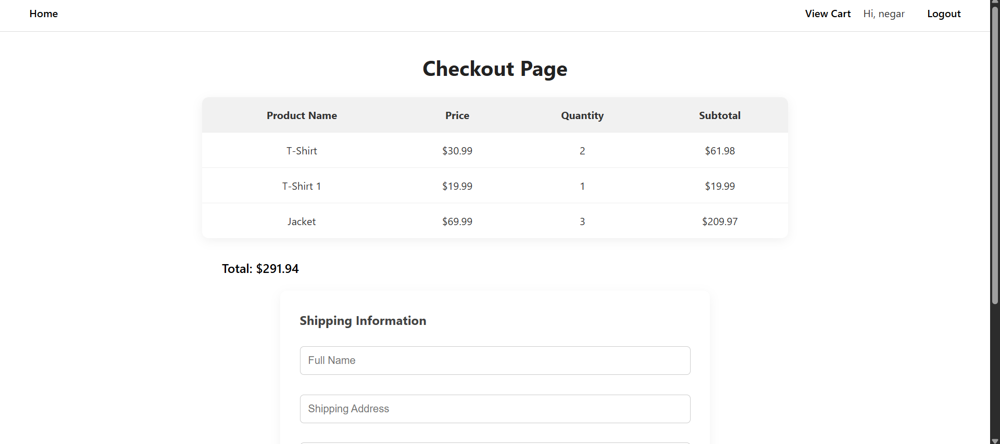

# 🛒 ShopEasy – Java E-commerce Platform

ShopEasy is a full-stack e-commerce web application built with **JSP**, **Servlets**, and **JDBC** (Java EE stack). It enables users to browse products, view details, manage a cart, and complete a checkout process. Admins can manage the inventory through a separate dashboard.

---

## 📸 Screenshots

### 🏠 Homepage


### 🧾 Product Detail


### 🛍️ Cart Page


### 💳 Checkout Page


---

## ⚙️ Features

### ✅ User Features
- Sign up, log in, and manage sessions
- Browse products and view details
- Add to cart, update quantity, and remove items
- Checkout with form validation

### ✅ Admin Features
- Access `AdminPanel.jsp`
- View all products
- Add/edit/delete products (CRUD)
- Role-based access control

---

## 🧱 Technologies Used

- **Java EE** (Servlets + JSP)
- **JDBC** for database interaction
- **HTML/CSS** for UI
- **Oracle/MySQL** (JDBC-based)
- **Git & GitHub** for version control

---

## 🧠 Object-Oriented Principles

- ✅ **Encapsulation**: Private fields with public getters/setters
- ✅ **Inheritance**: `User` inherits from `Person`
- ✅ **Interface implementation**: `User implements IUser`, `Product implements IProduct`
- ✅ **Polymorphism**: Interfaces used for flexibility
- ✅ **Exception Handling**: Input validation and DB error handling

---

## 📁 Folder Structure

```

src/
├── controller/          // Servlets (e.g., LoginServlet, RegisterServlet)
├── dao/                // Database access logic
├── model/              // POJOs: User, Product, CartItem, + interfaces
├── views/              // JSP pages: index.jsp, product.jsp, cart.jsp
└── utils/              // DBConnection.java

```

---

## 📖 Setup Instructions

1. Clone the repository  
   `git clone https://github.com/yourusername/shopeasy.git`

2. Import the project in IntelliJ (Java + Maven/EE)

3. Configure your database connection in `DBConnection.java`

4. Run on a servlet container (e.g., Apache Tomcat)

5. Access the app on `http://localhost:8080/ShopEasy`

---

## 💬 Reflection & Learning

> "This project helped me understand how to design and build an end-to-end application using Java EE. I strengthened my understanding of Servlets, MVC architecture, JDBC integration, form validation, and Git workflows. It was a great opportunity to apply object-oriented programming concepts in a real-world context."

---
## 📋 Project Task Backlog – ShopEasy

This project follows the structure outlined in the final evaluation for `420-PA3-AS`. The frontend is built with JSP/CSS, backend with Java Servlets and JDBC, and deployed via Apache Tomcat.

| Task Name               | Category        | Description                                            | Assigned To         |
|-------------------------|-----------------|--------------------------------------------------------|---------------------|
| Setup Project Structure | Core            | Initialize folders: model, dao, servlet, WEB-INF       | Negar               |
| Create Database Schema  | Core            | Design tables: products, users, orders, cart_items     | Betty               |
| Configure DB Connection | Core            | Create DB connection utility and test it               | Betty               |
| Product Entity & DAO    | Core            | Create Product class and CRUD                          | Betty               |
| User Entity & DAO       | Core            | Implement User class, login, and registration          | Betty               |
| Order Entity & DAO      | Core            | Handle order storage and retrieval                     | Naomi               |
| Basic UI Layout (JSP)   | UI              | Create `index.jsp` and layout templates with CSS       | Negar               |
| Product Listing Page    | User            | List products using Servlet + JSTL                     | Negar, Naomi        |
| Product Details Page    | User            | View detailed info when clicking product               | Betty               |
| Cart Page               | User            | Add/view/remove items using session tracking           | Naomi               |
| Checkout Page           | User            | Capture user info and process order                    | Naomi               |
| Admin Panel (JSP)       | Admin           | Add/edit/delete products                               | Betty               |
| Error Handling          | Core            | Implement try/catch and user error messages            | All team            |
| JavaDoc Documentation   | Documentation   | Add JavaDoc to all classes and methods                 | All team            |
| GitHub Repo Setup       | Version Control | Initialize and push initial project                    | Negar               |
| Branching for Team      | Version Control | Create branches per developer                          | Everyone            |
| Final UI Styling        | UI              | Polish layout and make responsive                      | Negar               |
| User Manual             | Documentation   | Write brief usage guide in `README.md`                 | Negar               |
| Team Reflection         | Professional    | Prepare final 500-word team reflection                 | Team                |
| Presentation Prep       | Professional    | Build final demo and slides                            | Team                |
| Create Base Class       | OOP             | Inherit User/Admin from `Person`                       | Betty               |
| Implement Interfaces    | OOP             | Implement `IUser`, `IProduct` (or Payable, etc.)       | Negar               |

---

## 👨‍💻 Author

**Negar Pirasteh**  
College: LaSalle College | Program: Computer Science Technology  
GitHub: [@negarprh](https://github.com/negarprh)

**Betty Dang**  
College: LaSalle College | Program: Computer Science Technology  
GitHub: [@BettyDang](https://github.com/BettyDang)

**Naomi (Ngoc Yen Nhi) Pham**  
College: LaSalle College | Program: Computer Science Technology  
GitHub: [@Naomiphamm](https://github.com/Naomiphamm)

---

## 📝 License

This project is for educational purposes under the LaSalle College Winter 2025 Java OOP course.

